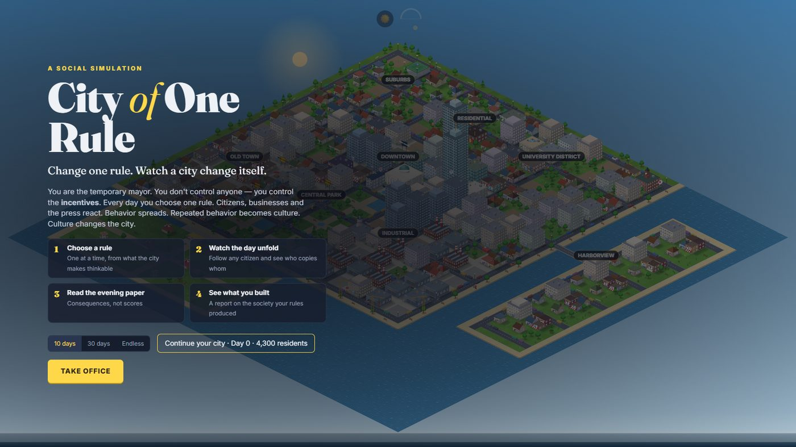
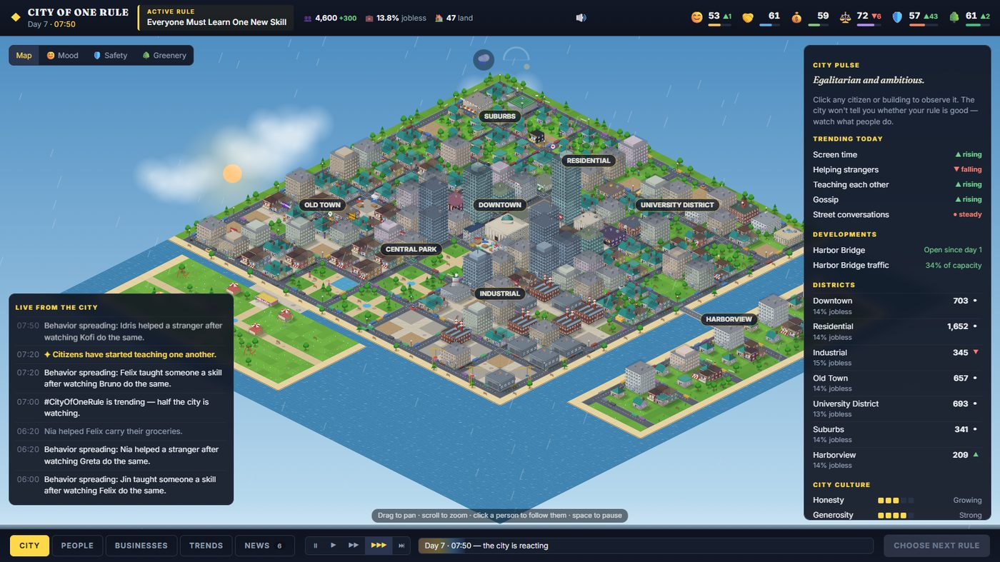
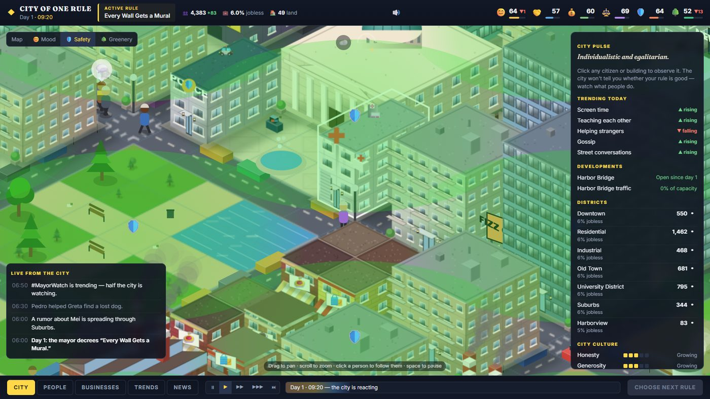
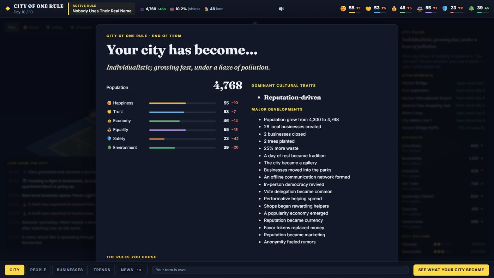

<div align="center">

# 🏙️ City of One Rule

### *Change one rule. Watch a city change itself.*

[](https://github.com/Sri-Gowtham/city-of-one-rule/actions/workflows/check.yml)
[](https://github.com/Sri-Gowtham/city-of-one-rule/actions/workflows/deploy.yml)

**[▶ Play it now](https://sri-gowtham.github.io/city-of-one-rule/)**

</div>

---

You are the temporary mayor of a city you don't control. You can't move a single citizen — you can only set **one rule per day**, drawn from a shuffled deck of 40. Then you watch: citizens react, behavior spreads from person to person, repeated behavior becomes culture, and culture reshapes the city — which grows, evolves and builds its own infrastructure on its own.

There's no score to maximize. The only question is: **what kind of society did your rules create?**

Everything on screen is drawn procedurally on a `<canvas>` — no image assets, no external dependencies beyond React.

<table>
<tr>
<td width="50%"></td>
<td width="50%"></td>
</tr>
<tr>
<td width="50%"></td>
<td width="50%"></td>
</tr>
</table>

---

## 🕹️ How it plays

| | |
|---|---|
| **1. Choose a rule** | One at a time, from what the city makes thinkable |
| **2. Watch the day unfold** | Follow any citizen and see who copies whom |
| **3. Read the evening paper** | Consequences, not a scoreboard |
| **4. See what you built** | An end-of-term report on the society your rules produced |

Three ways to play: a **10-day** term, a **30-day** term, or **Endless**, where you can end the term whenever you choose.

## ✨ What's actually simulated

- **40 rules** across 8 themes (work, money, social, environment, mobility, civic, culture, wellbeing) — dealt from a shuffled deck so the same handful never keeps reappearing
- **72 citizens**, each with hidden traits, learned behavior propensities, daily schedules, moods, grievances and a memory of who they saw do what
- **A living city**: districts evolve nightly — migration, jobs, income, land value, building condition and levels, population turnover
- **Emergent infrastructure**: a shopping mall, Harbor Bridge, an elevated Metro Loop with circulating trains, a port, a shipyard, an airport, a theme park — all triggered by what the city becomes, not scripted to appear
- **A full day/night sky** (sun, moon, stars, horizon glow) and **deterministic daily weather** (clear / cloudy / rainy / foggy) with drifting clouds, rain, fog, puddles and animated water — reproducible from the same seed and day, every time
- **Procedural news**: a nightly front page and an end-of-term Society Report, written from what the city's numbers actually did

## 🚀 Run it locally

```bash
npm install
npm run dev
```

## ✅ Verify

```bash
npm run build   # typecheck + production build
npm run check   # 30+ headless invariant checks — rule catalog integrity,
                 # deck fairness, long-run stability, determinism,
                 # save/load round-trip, weather, Metro Loop geometry
```

Both run automatically on every push and pull request via [GitHub Actions](.github/workflows/check.yml).

## 🧠 How it's built

```
src/
├─ sim/            deterministic simulation engine (no rendering)
│  ├─ world.ts        isometric city grid: 8 districts, a theme park, pathfinding
│  ├─ citizens.ts      72 residents with hidden traits and daily schedules
│  ├─ evolution.ts     nightly evolution: migration, jobs, land value, building levels
│  ├─ projects.ts      emergent infrastructure and its build pacing
│  ├─ rules.ts         the 40 rules — effects, unlock conditions, combinations
│  ├─ engine.ts        schedules, encounters, contagion, culture, grievances, metrics
│  ├─ news.ts / report.ts   the evening paper and the Society Report
│  └─ save.ts          localStorage save/load (deterministic round-trip)
├─ render/         procedural isometric renderer — sky, weather, buildings,
│                  street life, the Metro Loop, map lenses
└─ ui/             React HUD — rule draft, live feed, City Pulse, tabs,
                  newspaper, Society Report, title screen
```

Full design spec: [GAME_SPEC.md](./GAME_SPEC.md).

## 🎮 Controls

`Drag` to pan · `Scroll` to zoom · `Click` a person or building to observe them · `Space` pauses · `1` `2` `3` set speed.

## 📋 Known limitations

- Narrative (headlines, quotes, the Society Report) is template-based, not LLM-generated — a deliberate tradeoff to keep the game fully offline with no API key or network dependency.
- Save/load is per-browser `localStorage` only — no cloud save or cross-device continuation.
